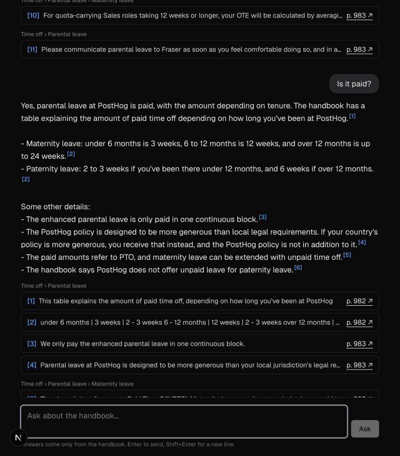
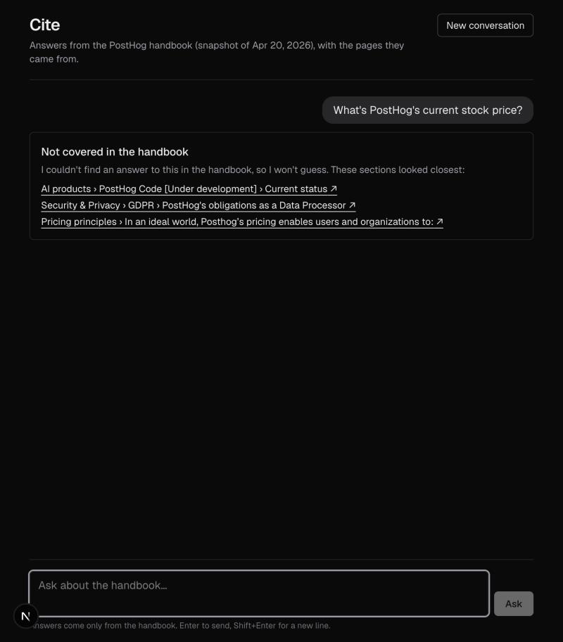

# Cite

Ask questions about the company handbook and get answers grounded in it. Every answer cites the exact handbook passages it came from, with page numbers that open the PDF at the right page. If the handbook doesn't cover a question, Cite says so instead of guessing.

The handbook is PostHog's public handbook (`public/handbook.pdf`, printed 2026-04-20; 1,076 pages, ~500k tokens).

| A follow-up, rewritten and answered with citations | A question the handbook doesn't answer |
|---|---|
|  |  |

## Quick start

Requires Node.js 22+ and an [Anthropic API key](https://console.anthropic.com/).

```bash
npm install
cp .env.example .env.local   # then put your key after ANTHROPIC_API_KEY=
npm run dev                  # open http://localhost:3000
```

The search index is committed (`data/index/`), so there is no build step. The first question downloads a small embedding model (~35 MB, once, into `.cache/models/`), so it takes a few extra seconds.

## How it works

```
question → [rewrite follow-up] → search → Claude (citations on) → grounding gate → [gap re-search] → answer + citation cards
```

1. **Ingest (offline, `npm run ingest`).** The PDF is parsed using its layout, not just its text: font size identifies section titles and sub-headings, line spacing separates paragraphs, indentation gives list nesting, and each indentation's own right margin tells a wrapped line from a deliberate break (text in callout boxes wraps early). The 254 sections are split into 3,211 chunks of up to 1,000 characters, never spanning two sub-headings. Each chunk is embedded locally with arctic-embed-s, a small model trained for search.
2. **Follow-ups.** In a conversation, Claude Haiku 4.5 rewrites a follow-up such as "Is it paid?" into a standalone question ("Is the parental leave policy paid?"), shown in the UI as "Searched for: …". If the rewrite fails, the original question is used.
3. **Search.** Semantic search finds the 12 chunks closest in meaning to the question, so paraphrases match ("ill" → "sick"). A keyword safety net covers what embeddings miss: if the question contains a word that appears in at most 3 chunks (`search_insights`, "Hedgehouse", an email address), keyword search (BM25) looks it up, and its best match takes the last slot unless semantic search already found it. Earlier versions merged the keyword and semantic rankings instead; [Evaluation](#evaluation) explains why that was dropped.
4. **Answer with citations.** Claude Sonnet 5.5 answers using only those chunks, via Anthropic's citations feature. Each paragraph is a separate citable block, so every quote is an exact handbook paragraph with a known page.
5. **Grounding gate.** Each citation is checked against the text we sent. An answer with no valid citations is never shown as an answer; it becomes "Not found in the passages searched", with the closest sections listed. Two kinds of uncited sentence are dropped: a summary that the cited sentence right after it repeats, and a remark about "the passages" (Claude's word for what it was given, which the employee never sees). Other answer text without a citation is shown grey and dotted, as unsupported, except a closing lead-in ending in ":" that introduces cited text.
6. **Gap re-search.** Claude sees 12 passages, not the whole handbook, so it can't know what the handbook *doesn't* say. Instead of writing "the handbook doesn't say X", it lists X as a gap. If the passages don't answer the question at all, Claude says so and names what to search for next, in the handbook's likely wording. Cite searches each gap on its own and, if that finds passages Claude hasn't seen, asks Claude again with them added. Gaps that remain are shown as "Not found in the passages searched", with a note that the handbook may still cover them.

The full design, with the alternatives considered and why they were rejected, is in [docs/DESIGN.md](docs/DESIGN.md).

## Commands

| Command | What it does |
|---|---|
| `npm run dev` | Run the app at http://localhost:3000 (this computer only) |
| `npm run search -- "question"` | Show the top search results, their similarity to the question, and what the keyword safety net added (no API key needed) |
| `npm run eval` | Retrieval eval (no API calls): is the passage holding the answer in the top 12, with and without the keyword safety net. Defaults to `eval/questions.json`; pass another set, e.g. `eval/search-dev.json` |
| `npm run eval -- --answers` | Answer eval through the full pipeline (~20–25¢ per set). Add `eval/holdout.json` to run the held-out set |
| `npm run eval -- --regrade` | Grade the saved answers again with the current rules (no API calls, writes nothing) |
| `npm run ingest` | Rebuild `data/index/` from the PDF (~1 minute); previews go to `.cache/` |
| `npm test` | Unit tests (layout parsing, chunking, keyword safety net, index checks, grounding gate, gaps, the ask pipeline and route, follow-up rewriting) |
| `npm run typecheck` / `npm run lint` | Static checks |

## Configuration

| Variable | Default | |
|---|---|---|
| `ANTHROPIC_API_KEY` | — | Required |
| `CITE_ANSWER_MODEL` | `claude-sonnet-5-5` | Model that writes answers (Sonnet/Opus family) |
| `CITE_REWRITE_MODEL` | `claude-haiku-4-5` | Model that rewrites follow-up questions |

## Evaluation

There are five blind question sets, each written by separate agents that never saw the app's search or any results:
- **Set A** ([eval/questions.json](eval/questions.json)): 10 answerable questions, 3 follow-ups, 3 out-of-scope.
- **Set B** ([eval/holdout.json](eval/holdout.json)): 10 answerable questions, 2 follow-ups, 2 out-of-scope.
- **Search sets**, written for choosing the search method ([eval/SEARCH.md](eval/SEARCH.md)): a tuning set ([eval/search-dev.json](eval/search-dev.json), 40 questions), a held-out set for the final check ([eval/search-holdout.json](eval/search-holdout.json), 24), and a set where each question hinges on a rare exact name such as `search_insights` or `/kudos` ([eval/search-exact.json](eval/search-exact.json), 32).

How the questions were made:
- **Sections drawn at random.** A seeded shuffle ([eval/sample-sections.mjs](eval/sample-sections.mjs)) picked the sections. Half come from the people/company policy pages, half from anywhere in the handbook.
- **Phrased like an employee.** Sets A and B, and about two-thirds of the search tuning and held-out questions, use an employee's own words, not the handbook's, which makes keyword matching harder. The rest name a term an employee would know ("Brex", "incident.io"); the exact-name set uses rare handbook strings on purpose.
- **Answer locations found by text search.** The ground truth comes from grep over the parsed text, not from the app.

Sets A and B were each committed before their first run; the search sets were written, and checked against the text, before any search ran on them. Set A was used for tuning. Set B was written after tuning and run once, so its "before" numbers below are the honest held-out measure. The gap re-search was designed after reading set B's failures, so set B's "now" numbers aren't held out. Method notes: [eval/QUESTIONS.md](eval/QUESTIONS.md), [eval/HOLDOUT.md](eval/HOLDOUT.md), [eval/SEARCH.md](eval/SEARCH.md).

**Retrieval** (is the passage holding the answer among those sent to Claude?). A chunk from the right section isn't enough: sections have a median of 10 chunks (13 on average), and the older section-level check credited set A with 9/10 when the answer itself was in the top 8 for 6. The first three columns count the top 8, which Claude got until the search sent 12.

| | MiniLM + keyword merge (before) | arctic-embed-s (int8) | + keyword safety net | **top 12 (now)** |
|---|---|---|---|---|
| Set A (10) | 6 | 8 | 8 | **8** |
| Set B (10) | 3 | 4 | 4 | **5** |
| Search tuning set (40) | 28 | 32 | 32 | **32** |
| Search held-out set (24) | 18 | 20 | 20 | **21** |
| Exact-name set (32) | 22 | 27 | 30 | **31** |
| **All 116** | 77 (66%) | 91 (78%) | 94 (81%) | **97 (84%)** |

Sending 12 passages instead of 8 adds three answers, including "is there a rubric … to move up here?", whose answer (no formal progression framework) ranked 12th behind sales passages about qualifying deals and moving up to executive stakeholders. It costs about a quarter more input per answer. Sending 16 would add two more (99 of 116) for twice the passages of the top 8; capping chunks per section instead lost hits (86–93).

The held-out set's first and only blind run compared four finalists: the old search found 18 of 24, full-precision arctic-embed-s 19. The int8 version shipped here was chosen afterwards, for its size, and scores 20.

**Answers** (full pipeline). The automated check only asks whether an answer cites the right section, so the "correct" rows come from blind re-grades against each question's reference answer and the handbook text. The graders were two separate Claude agents that saw neither the automated grades nor this README; they agreed on every row in runs 1–3, and on 26 of 30 in run 4. Run 1 is the tuned pipeline ([eval/results/regrade-blind.json](eval/results/regrade-blind.json), answers from commit 91f2d69); run 2 adds the gap re-search ([regrade-blind-gaps.json](eval/results/regrade-blind-gaps.json)); run 3 adds the new search and the answer changes below: "not found" replies are searched again, a cited first sentence, and no remarks about the passages ([regrade-blind-search.json](eval/results/regrade-blind-search.json)); run 4 stops filtering "the handbook doesn't say" sentences out of the answer and drops only uncited remarks about "the passages" ([regrade-blind-passages.json](eval/results/regrade-blind-passages.json), answers from commit e3b7fea). Where run 4's graders differed, the cell shows grader 1's count, with grader 2's in brackets.

| | Set A: run 1 | run 2 | run 3 | **run 4** | Set B: run 1 | run 2 | run 3 | **run 4** |
|---|---|---|---|---|---|---|---|---|
| Answerable: correct (blind re-grade) | 7/10 | 8/10 | 9/10 | **9/10** | 4/10 | 5/10 | 7/10 | **7/10** |
| Answerable: partially correct | 0/10 | 0/10 | 1/10 | 0/10 [1] | 0/10 | 0/10 | 0/10 | 0/10 [1] |
| Answerable: answers a different question | 0/10 | 0/10 | 0/10 | 0/10 | 0/10 | 0/10 | 1/10 | 1/10 |
| Answerable: wrongly says the handbook doesn't say it | 1/10 | 0/10 | 0/10 | 1/10 [0] | 2/10 | 0/10 | 0/10 | 2/10 [0] |
| Answerable: safe miss ("not found", or the gap named) | 2/10 | 2/10 | 0/10 | 0/10 | 4/10 | 5/10 | 2/10 | 0/10 [1] |
| Answerable: cites the right section (automated) | 8/10 | 8/10 | 10/10 | 10/10 | 6/10 | 5/10 | 7/10 | 9/10 |
| Follow-ups: correct (blind re-grade) | 2/3 | 2/3 | 3/3 | 3/3 [2] | 2/2 | 2/2 | 2/2 | 2/2 |
| Out-of-scope: declined | 2/3 | 1/3 | 0/3 | 0/3 | 1/2 | 1/2 | 1/2 | 1/2 |
| Out-of-scope: partial answer that names the gap | 1/3 | 2/3 | 3/3 | 3/3 | 1/2 | 1/2 | 1/2 | 1/2 |

Each column is a single run, so a one-question change is 10 points. Runs 1 and 2 used the old search (MiniLM with the keyword merge) and the index from before the parser fixes (3,205 chunks). Run 3 changed both search and answering, so its gains can't be split between them: the new search put the answer in the first 8 results for some questions ("who started PostHog"), and the re-search of "not found" replies found it for others ("what share of customers come from recommendations"). Run 3 was measured just before a review tightened the answer changes (see the git log); the tightening doesn't change which passages are found. Run 3 also predates the removal of the absence-claim filter: it took out uncited remarks about the passages (in 4 of 30 answers) and searched the topics of some "the handbook doesn't say" sentences again. Remarks about the passages are still dropped; other such sentences are now left in place (grey when uncited) and aren't searched again. Run 4 measures that: as many correct answers as run 3 (9 and 7), and no answer that says outright that the handbook lacks something. Its "wrongly says" counts are three answers whose "Not found in the passages searched" box names something the handbook does cover (the security review for workflow PRs, what to do with leads under $20k, and checking what events a customer's site sends; for that last one, grader 1 also counted a grey opener implying the handbook gives only one way to inspect a site). Grader 1 scored those as wrongly saying the handbook doesn't say it; grader 2 scored them partially correct or a safe miss, as runs 2 and 3 scored the same kind of gap.

**What the eval showed:**
- **Not every failure was safe.** Before the gap re-search, in 4 of the 25 answerable questions and follow-ups, search missed the passage with the answer, and Claude turned "not in my passages" into "the handbook doesn't say". It told the employee the handbook doesn't say a side gig needs approval (it says to get an exec's sign-off, p966), names no special reviewer for PRs that change a GitHub Actions workflow (they need a security-team review, p128), and doesn't say how support tickets are split (p1052). The automated check passed all four, because it only looked at which section was cited.
- **The gap re-search fixed three of them.** In the new run, no answer says the handbook lacks something it has. In all three repaired answers (both side-gig answers and the support split), the passage with the answer was not in the first 8 search results; searching Claude's own gap phrases ("approval or disclosure process for side gigs or freelance work") found it, and Claude's second answer used it. The fourth, the PR-review rule, sits in a post-mortem's list of changes that no search finds; it is now a safe miss, listed as "not found in the passages searched". One answer got worse: the logs follow-up opened with "The handbook doesn't show that the older data was recovered", a hedge the absence detector didn't catch, so both graders scored it partially correct. (The detector has since been removed; see Limitations.)
- **Search recall was the bottleneck, and section-level hits hid how much.** The first search used MiniLM, a general-purpose embedding model, merged with keyword search. Counting only the passage that holds the answer, it found 77 of 116. Across 9 embedding models, rerankers and fusion settings ([eval/SEARCH.md](eval/SEARCH.md)), the clearest gain came from a model trained for search: arctic-embed-s (int8, 35 MB) found 91, and ranked the answer first for 36 of the 64 blind search questions, against 20.
- **Merging keyword and semantic rankings hurt.** With Reciprocal Rank Fusion, a chunk only semantic search found, even at #1, lost to chunks both searches ranked mid-list, and at the tuned half weight a chunk only keyword search found could never reach the top 8. (Under the stricter check, the old equal-weight merge actually did better than the tuned half weight, 82 vs 77 of 116, mostly on exact names: tuning on set A's 10 questions didn't hold up.) With full-precision arctic-embed-s, merging keyword search in at weights from 0.1 to 1 gained at most one top-8 hit (on 60 questions) and lowered #1 hits at every weight (27 → 15–25). The narrow safety net that replaced it acted on 20 of 116 questions, added the answer for 3 exact-name questions, and pushed no correct passage out.
- **What search still misses:** questions worded differently from the handbook ("people recommending us" vs "word-of-mouth growth"; "a rubric to move up" vs "a formal career progression framework" is found, but only in 12th place, the last passage sent), names made of common words ("Product for Engineers"), and facts mentioned in passing in a passage about something else ("our product managers (we have four today)"). The held-out search set shows the limits honestly: in its one blind run, top-8 hits rose only from 18 to 19 of 24; most of the gain there is in ranking.
- **Answer checks are section-level.** The automated answer check only asks whether an answer cites the right section, so only reading the answers against the reference (the blind re-grade) catches a wrong answer that cites the right section. For example, "who started PostHog" once retrieved the 2024 entry of the company timeline, not the founding entry, and Claude correctly declined. To help with that, the eval sends every answer that names a gap to a person, with the reference answer printed next to it.
- **Partial answers to out-of-scope questions** cite what *is* there and list the rest as gaps ("on-call compensation or time off in lieu for weekend on-call"). An early version added uncited advice ("…is probably the place to ask"); the prompt forbids it, and uncited text is now shown grey.
- **Cost and speed:** in run 2, about 1.5¢ per question on average (Sonnet 5.5; $0.24 for set A, $0.20 for set B); most answers took one Claude call, about 1.1¢ and 2–3 s (median), and the 8 that needed the gap re-search took about 2.6–3¢ and 6–7 s. In run 3, "not found" replies and more partial answers went through the re-search (15 of 30 questions), so the average rose to about 2¢ ($0.27 for set A, $0.32 for set B) and the median time to about 4.3 s. Run 4 cost about the same ($0.28 and $0.32; median 4.3 s and 4.8 s). Follow-ups add about 1 s for the rewrite.

## Assumptions

- The PDF is the source of truth, not the live posthog.com handbook, which has changed since it was printed.
- Ingestion relies on this PDF's structure (each section starts with a title and a `contents/handbook/….md` path line). Other PDFs would need a generic fallback chunker.
- The handbook is trusted content. The prompt tells Claude to treat excerpt text as reference material, but there are no stronger prompt-injection defenses.
- Single user, on this computer: no auth, no persistence. The conversation lives in the browser and clears on refresh. Because every question spends the owner's API credit, `npm run dev` and `npm start` listen on 127.0.0.1 only, and `/api/ask` refuses requests from other websites (Origin), other host names (Host, which stops DNS rebinding), non-JSON bodies, and oversized ones. Running `next dev` without `-H 127.0.0.1` would expose the server to your network again.

## Limitations

- **Search misses some questions worded differently from the handbook** ("people recommending us" vs "word-of-mouth growth") and names made of common words ("Product for Engineers"). Across the eval sets, the passage with the answer is outside the top 12 for 19 of 116 questions. Cite then says "not found", which is safe but unhelpful, or the gap re-search finds it.
- **Some answer text is uncited.** The gate requires at least one valid citation per answer, not one per sentence. In run 2, about 19 of 22 answers opened with an uncited sentence, so the grey "not cited" style marked the main answer. The prompt now asks for a cited first sentence, and the gate drops an uncited sentence that the cited one after it repeats; in runs 3 and 4, 5 of 28 and 5 of 29 answers opened with an uncited sentence (`npm run eval -- --answers` reports this). Framing lines ("What the handbook does cover:") stay uncited. The UI shows uncited text grey with a dotted underline, and the server log reports uncited characters per answer.
- **A gap may be wrong.** "Not found in the passages searched" means search didn't find it, not that the handbook lacks it. The gap re-search fills some gaps but not all: in the eval it found the passage with the answer for 3 of the 4 earlier false "the handbook doesn't say" answers, but not the fourth. When Claude still writes "the passages don't say X" despite the prompt, the sentence is dropped, since the gaps box already says what wasn't found. Other wordings ("the handbook doesn't say X") are left as written: uncited, they're shown grey and dotted as unsupported; a clause inside a cited sentence isn't marked; neither is searched again. Cite used to detect and remove every wording with patterns; that was dropped because English has too many wordings for patterns to cover, and blind graders rated answers without it the same as with it (21 of 30 correct, 2 false "doesn't say" each; [eval/results/regrade-blind-simplify.json](eval/results/regrade-blind-simplify.json)). Both false ones in the run without it began "The passages don't…", which is why that one wording is still dropped. The eval flags answers with a sentence that names the handbook or the passages next to a negation, for a person to check.
- **Tables** whose cells wrap onto several lines come out jumbled in extraction. Single-line tables read correctly (cells are separated with `|`).
- **Names and other link text** are missing from the PDF's text layer ("requests are handled by , , and on the team"), so "who handles X" questions often can't be answered.
- **Bullets** that sit next to each other occasionally merge into one paragraph; the PDF doesn't contain the bullet glyphs.
- **No streaming.** An answer appears all at once, after the grounding gate has checked it.
- **The `#page=N` links** jump to the page in Chrome and Firefox. Safari may open the PDF at page 1.

## Next steps

1. **Improve search recall further.** Rewrite *every* question (not just follow-ups) into handbook-style search terms before searching (Haiku, ~0.1¢ and ~1 s per question); this targets the remaining vocabulary gaps. Re-run the answer eval with the new search (~45¢).
2. **Grow the answer eval.** The search sets have 96 questions, but the answer eval still runs on sets A and B (20 answerable questions), so a one-question difference there is 5–10 points.
3. **Check grounding per sentence.** For each uncited sentence that makes a claim, check with a cheap model call that it follows from the quotes cited next to it, and label the ones that pass "summary of [n]" instead of greying them. Dropping them instead would often drop the answer itself.
4. **Hosting.** Deploy with auth and a spend cap. It was skipped because a public URL spends the owner's API credit, and the embedding runtime may exceed Vercel's function size limit.

## How I used AI

<!-- DRAFT written by Claude from the session history. Ryan: rewrite this in your own words before submitting. -->

I built Cite with Claude Code as a pair programmer.

- **Research before code.** Claude extracted and measured the PDF (1,076 pages, ~500k tokens), which ruled out sending the whole handbook per question. It also test-ran the TypeScript PDF and embedding libraries before I committed to a stack.
- **Design review.** Claude interviewed me through every design decision in rounds, each with a recommendation. I made the calls: for example, multi-turn conversation (against its initial recommendation), refuse-and-point for out-of-scope questions, and opening the PDF at the cited page. The result is [docs/DESIGN.md](docs/DESIGN.md).
- **Implementation.** Claude wrote the code and tests; I reviewed each piece through walkthroughs on real data. I initially planned to write the chunker, fusion function, prompt and grounding gate myself, then chose to learn them by reading and questioning working code, given the time budget.
- **Verification.** Claude ran the code against the real PDF at each step and fixed what that surfaced. Examples: page headers leaking into the text, wrapped lines being split, false page-break joins, and a React effect that crashed the page.
- **Evaluation without bias.** I asked for the eval questions to be written "unbiased". Claude had separate agents, which never saw the app's search, write them from randomly drawn sections, and kept a second set back until tuning was done. That held-out set caught that our first set overstated search quality.
